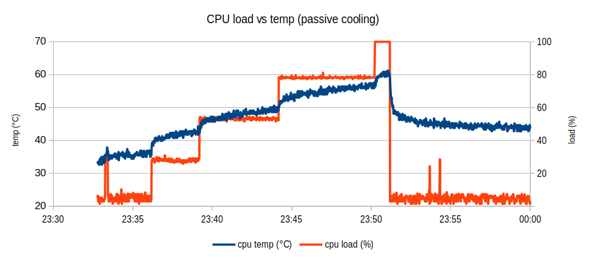
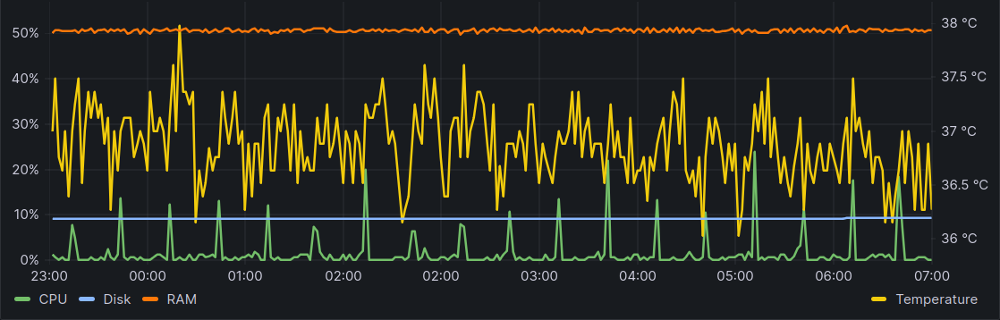
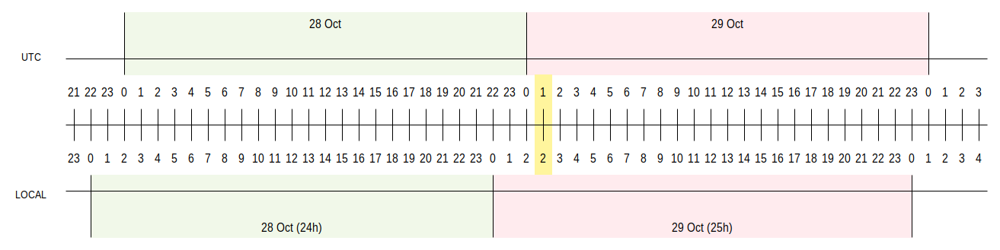

# Solarmon - Dashboard con InfluxDB e Grafana

L'attuale implementazione di [Solarmon](https://github.com/gzuliani/solarmon) consente il salvataggio dei dati acquisiti in un file CSV o il loro invio alle API di [EmonCMS](https://emoncms.org/). Nell'ottica di svincolarsi da quest'ambiente ho voluto verificare se è possibile estendere Solarmon in modo da salvare i dati in un'istanza [InfluxDB](https://www.influxdata.com/) e usare [Grafana](https://grafana.com/) per costruire una dashboard simile a quelle che si possono definire in EmonCMS.

## Indice

- [Solarmon - Dashboard con InfluxDB e Grafana](#solarmon---dashboard-con-influxdb-e-grafana)
  - [Indice](#indice)
  - [Hardware](#hardware)
  - [Software di base](#software-di-base)
    - [Supporto RTC DS3231](#supporto-rtc-ds3231)
    - [Adattatore USB/RS485](#adattatore-usbrs485)
    - [Funzioni di utilità](#funzioni-di-utilità)
      - [Rilevamento della temperatura](#rilevamento-della-temperatura)
      - [Rilevamento del livello del segnale WiFi](#rilevamento-del-livello-del-segnale-wifi)
  - [Software applicativo](#software-applicativo)
    - [InfluxDB](#influxdb)
      - [Installazione di InfluxDB](#installazione-di-influxdb)
      - [Configurazione di InfluxDB](#configurazione-di-influxdb)
    - [Grafana](#grafana)
      - [Installazione di Grafana](#installazione-di-grafana)
      - [Configurazione di Grafana](#configurazione-di-grafana)
      - [Grafana sulla porta 80](#grafana-sulla-porta-80)
    - [Solarmon](#solarmon)
      - [Strategie iniziali](#strategie-iniziali)
  - [Appendice A - Note su InfluxDB](#appendice-a---note-su-influxdb)
    - [Note generali](#note-generali)
    - [Importazione CSV](#importazione-csv)
    - [Esportazione CSV](#esportazione-csv)
    - [Cancellazione dei dati](#cancellazione-dei-dati)
    - [Spazio occupato su disco](#spazio-occupato-su-disco)
    - [Backup](#backup)
    - [Restore](#restore)
    - [Task di aggregazione giornaliero](#task-di-aggregazione-giornaliero)
    - [Determinazione degli intervalli senza campioni](#determinazione-degli-intervalli-senza-campioni)
  - [Appendice B - Note su Grafana](#appendice-b---note-su-grafana)
  - [Appendice C - Note sull'inverter](#appendice-c---note-sullinverter)
    - [Punti di attenzione](#punti-di-attenzione)
  - [Appendice D - Passaggio dall'ora legale a quella solare](#appendice-d---passaggio-dallora-legale-a-quella-solare)
  - [Appendice E - Esempio di query "complessa"](#appendice-e---esempio-di-query-complessa)

## Hardware

Il sistema girerà su una Raspberry Pi 4 con 2GB di RAM acquistata per l'occasione, corredata del solito RTC DS3231. Necessitando la scheda necessita di raffreddamento, ho optato per una soluzione passiva, un case in lega di alluminio:

Un breve stress test a suon di

    pi@raspberry:~ $ yes >/dev/null &

ne ha dimostrato l'efficacia: in sua assenza la scheda si è bloccata dopo un paio di minuti, quando ancora tre dei quattro core erano ancora completamente scarichi; con il dissipatore installato, dopo un minuto con carico CPU massimo, la temperatura è rimasta al di sotto dei 62°C:

## Software di base

Il sistema operativo prescelto è "Raspberry Pi OS" (ex Raspian), installato manualmente copiando su una scheda SD da 32GB l'immagine più recente disponibile nella [pagina dedicata](https://www.raspberrypi.com/software/operating-systems/) del sito ufficiale.

### Supporto RTC DS3231

Il primo passo consiste nell'attivare il supporto IC2 dall'interfaccia di configurazione di Raspberry Pi OS che si richiama col comando:

    pi@raspberry:~ $ sudo raspi-config

Selezionare la voce "5. Interfacing Options", quindi "P5 I2C", "Yes". Confermare con "Ok". A questo punto impartire i seguenti comandi:

    pi@raspberry:~ $ sudo reboot
    pi@raspberry:~ $ sudo i2cdetect -y 1

Alla posizione 68 della tabella emessa dal comando precedente deve comparire il codice `68` oppure `UU`:

        0  1  2  3  4  5  6  7  8  9  a  b  c  d  e  f
    00:          -- -- -- -- -- -- -- -- -- -- -- -- --
    10: -- -- -- -- -- -- -- -- -- -- -- -- -- -- -- --
    20: -- -- -- -- -- -- -- -- -- -- -- -- -- -- -- --
    30: -- -- -- -- -- -- -- -- -- -- -- -- -- -- -- --
    40: -- -- -- -- -- -- -- -- -- -- -- -- -- -- -- --
    50: -- -- -- -- -- -- -- -- -- -- -- -- -- -- -- --
    60: -- -- -- -- -- -- -- -- 68 -- -- -- -- -- -- --
    70: -- -- -- -- -- -- -- --

Continuare con i comandi:

    pi@raspberry:~ $ sudo modprobe rtc-ds1307
    pi@raspberry:~ $ sudo bash
    pi@raspberry:~ $ echo ds1307 0x68 > /sys/class/i2c-adapter/i2c-1/new_device
    pi@raspberry:~ $ exit

Verificare l'orario dell'orologio:

    pi@raspberry:~ $ sudo hwclock -r

Se la data non è corretta allinearla a quella di sistema (presumendo che questa sia corretta) con il comando:

    pi@raspberry:~ $ sudo hwclock -w

Completare la configurazione con i seguenti interventi:

- aggiungere la dicitura `rtc-ds1307` in coda al file **/etc/modules**
- aggiungere il frammento

      echo ds1307 0x68 > /sys/class/i2c-adapter/i2c-1/new_device
      sudo hwclock -s
      date

  in coda al file **/etc/rc.local**, prima del comando di uscita `exit`.

### Adattatore USB/RS485

Poiché Linux attribuisce un nome di dispositivo arbitrario — potenzialmente diverso ad ogni accensione — all'adattatore USB/RS485 che verrà utilizzato per raccogliere i dati dall'inverter e dai contatori di potenza, conviene associargli un nome simbolico fisso, per esempio **ttyUSB_RS485**. Dopo aver connesso l'adattatore alla scheda si ricavano gli identificativi del costruttore e del prodotto con il comando:

    pi@raspberry:~ $ lsusb
    Bus 002 Device 001: ID 1d6b:0003 Linux Foundation 3.0 root hub
    Bus 001 Device 007: ID 1a86:7523 QinHeng Electronics CH340 serial converter
    Bus 001 Device 003: ID 148f:7601 Ralink Technology, Corp. MT7601U Wireless Adapter
    Bus 001 Device 002: ID 2109:3431 VIA Labs, Inc. Hub
    Bus 001 Device 001: ID 1d6b:0002 Linux Foundation 2.0 root hub

Si tratta in questo caso del secondo dispositivo in elenco.

Creare il file **/etc/udev/rules.d10-usb-serial.rules** dal seguente contenuto:

    # QinHeng Electronics CH340 serial converter
    SUBSYSTEM=="tty", ATTRS{idVendor}=="1a86", ATTRS{idProduct}=="7523", SYMLINK+="ttyUSB_RS485"

Forzare il caricamento della nuova definizione con il comando:

        pi@raspberry:~ $ sudo udevadm trigger

A questo punto il dispositivo è riconosciuto come **/dev/ttyUSB_RS485** anziché **/dev/ttyUSB0**.

**Nota**: sebbene correttamente individuato dal sistema operativo, l'adattatore non è stato associato al dispositivo **/dev/ttyUSB0** in Ubuntu 22.04, a differenza di quanto accaduto in Raspberry Pi OS. Il problema (descritto per esempio [qui](https://askubuntu.com/questions/1403705/dev-ttyusb0-not-present-in-ubuntu-22-04)) sta nel fatto che a quella stessa coppia è stato associato un altro dispositivo. La soluzione consiste nel commentare la riga

    ENV{PRODUCT}=="1a86/7523/*", ENV{BRLTTY_BRAILLE_DRIVER}="bm", GOTO="brltty_usb_run"

nel file **/usr/lib/udev/rules.d/85-brltty.rules**.

### Funzioni di utilità

#### Rilevamento della temperatura

Per ricavare il valore del sensore di temperatura utilizzare indifferentemente:

    pi@raspberry:~ $ cat /sys/class/thermal/thermal_zone0/temp

che riporta la temperatura in millesimi di gradi centrigradi, oppure il più amichevole:

    pi@raspberry:~ $ vcgencmd measure_temp

I valori ottenuti dai due metodi combaciano. Valori ottimali della temperatura sono quelli al di sotto dei 50°C. Quelli accettabili al di sotto dei 60°C.

#### Rilevamento del livello del segnale WiFi

    pi@raspberry:~ $ iwconfig 2>/dev/null | grep -oP "Signal level=\K(.*)\s+$"

Una classificazione di massima di qualità del segnale ricevuto è:

- 30 dBm: eccellente
- 67 dBm: buono
- 70 dBm: accettabile
- 80 dBm: critico
- 90 dBm: insufficiente

Fonte: [MetaGeek](https://www.metageek.com/training/resources/understanding-rssi/)

## Software applicativo

### InfluxDB

#### Installazione di InfluxDB

InfluxDB 2.x richiede un sistema operativo a 64 bit. La versione corrente di InfluxDB è la 2.7. Per installarla è sufficiente seguire le istruzioni dal [sito ufficiale](https://docs.influxdata.com/influxdb/v2.7/install/):

    pi@raspberry:~ $ cd ~/Downloads

>     # Ubuntu/Debian AMD64
>     wget https://dl.influxdata.com/influxdb/releases/influxdb2-2.7.0-arm64.deb
>     sudo dpkg -i influxdb2-2.7.0-arm64.deb
>     sudo service influxdb start

Riavviare la scheda e assicurarsi che il servizio sia attivo:

    pi@raspberry:~ $ sudo service influxdb status
         ...
         Active: active (running) since Sat 2023-08-05 18:15:13 CEST; 31s ago

Per comodità conviene installare anche l'interfaccia a riga di comando (istruzioni alla pagina ):

    pi@raspberry:~ $ wget https://dl.influxdata.com/influxdb/releases/influxdb2-client-2.7.3-linux-arm64.tar.gz
    pi@raspberry:~ $ mkdir influxdb2-client-2.7.3
    pi@raspberry:~ $ tar -xf influxdb2-client-2.7.3-linux-arm64.tar.gz --directory ./influxdb2-client-2.7.3
    pi@raspberry:~ $ sudo cp influxdb2-client-2.7.3/influx /usr/local/bin/

#### Configurazione di InfluxDB

Conettersi alla GUI di InfluxDB all'indirizzo `http://<raspberry-pi-IP>:8086` e inserire le credenziali del primo utente del database:

- username: pi
- organization name: home
- bucket name: raw_data

In seguito alla creazione dell'utente InfluxDB fornisce l'*API token* che garantisce i privilegi di amministratore, e dovrà essere specificato ogni qualvolta si invocherà il comando `influxdb` da terminale. È tuttavia possibile associare questo token alla connessione di default in modo da risparmiarsi la fatica di indicarlo ogni volta:

    pi@raspberry:~ $ influx config create \
      --config-name default \
      --host-url http://localhost:8086 \
      --org home \
      --token <INFLUXDB-API-TOKEN> \
      --active

Conviene a questo punto creare un altro token, quello che utilizzerà Solarmon per autenticarsi all'API di InfluxDB. Entrare nella sezione **API TOKENS** della pagina **Load Data** e premere il pulsante **GENERATE API TOKEN**, quindi selezionare la voce "All Access API Token"; fornire un nome per il token (ad esempio "Solarmon"). Conservare il token per l'uso in Solarmon (cfr. parametro `influx_api_token` in **main.py**).

### Grafana

#### Installazione di Grafana

La versione più recente di Grafana è la 10.0.3. Le istruzioni per l'installazione su Raspberry Pi Desktop sono reperibili sul [sito ufficiale](https://grafana.com/docs/grafana/latest/setup-grafana/installation/debian/#2-start-the-server):

>     sudo apt-get install -y apt-transport-https
>     sudo apt-get install -y software-properties-common wget
>     sudo wget -q -O /usr/share/keyrings/grafana.key https://apt.grafana.com/gpg.key
>     echo "deb [signed-by=/usr/share/keyrings/grafana.key] https://apt.grafana.com stable main" | sudo tee -a /etc/apt/sources.list.d/grafana.list
>     sudo apt-get update
>     sudo apt-get install grafana

Le istruzioni proseguono nella pagina [Start the Grafana server](https://grafana.com/docs/grafana/latest/setup-grafana/start-restart-grafana/):

> The following instructions start the grafana-server process as the grafana user, which was created during the package installation.
>
> To start the service, run the following commands:
>
>     sudo systemctl daemon-reload
>     sudo systemctl start grafana-server
>     sudo systemctl status grafana-server
>
> [...]
>
> To configure the Grafana server to start at boot, run the following command:
>
>     sudo systemctl enable grafana-server

Sulla Raspberry Pi fisica l'avvio del server è avvenuto con successo, a differenza di quanto accaduto con Raspberry Pi Desktop su macchina virtuale VirtualBox nelle prove preliminari:

>     pi@raspberry:~ $ sudo systemctl status grafana-server
>     ● grafana-server.service - Grafana instance
>          Loaded: loaded (/lib/systemd/system/grafana-server.service; disabled; vend>
>          Active: failed (Result: signal) since Sat 2023-07-29 16:01:12 CEST; 4s ago

la causa è da ricondurre a una configurazione di Grafana incompatibile con l'ambiente virtuale. Personalmente sono riuscito a far avviare il server Grafana commentando la seguente impostazione nel file **/usr/lib/systemd/system/grafana-server.service**:

    SystemCallArchitectures=native

#### Configurazione di Grafana

La pagina di riferimento è [Use Grafana with InfluxDB OSS](https://docs.influxdata.com/influxdb/v2.7/tools/grafana/). Alcune considerazioni che emergono dall'analisi delle informazioni disponibili in rete sono:

- InfluxDB supporta due linguaggi di interrogazione: *InfluxQL* (una sorta di SQL) e *Flux* (funzionale). Il primo è nato su InfluxDB 0.x e 1.x, per poterlo usare sulla versione 2.x occorre mappare il vecchio concetto di *database* sull'attuale *bucket* (cfr. pagina [Manage DBRP mappings](https://docs.influxdata.com/influxdb/v2.7/query-data/influxql/dbrp/));

- Grafana sembra preferire InfluxQL. Sebbene la documentazione di InfluxDB riportI che InfluxDB v.2.x può essere interrogato da Grafana v.8.0 e successive per mezzo di query Flux, Grafana 10.0.1 dichiara:

  > Support for Flux in Grafana is currently in beta.

- InfluxQL non è utilizzabile dalla GUI di InfluxDB, che supporta solo Flux.

La scelta è ricaduta su Flux, in quanto permette di definire query molto più articolate di quanto possibile con InfluxQL.

Occorre innanzitutto generare un token di accesso ad InfluxDB: entrare nella sezione **API TOKENS** della pagina **Load Data** del portale InfluxDB e premere il pulsante **GENERATE API TOKEN**, quindi selezionare la voce "Custom API Token". Fornire un nome per il token (ad esempio "Solarmon Read Only") e concedere l'accesso in lettura ai bucket necessari (**raw_data** e **daily_data**, vedi più avanti).

Autenticarsi quindi nella GUI di Grafana con le credenziali di amministrazione e aggiungere una nuova *Data source* InfluxDB con le seguenti proprietà:

- **Query Language**: `Flux`
- **URL**: `http://localhost:8086`

Nella sezione **InfluxDB Details** vanno specificati i seguenti parametri:

- **Organization**: `home`
- **Token**: `<READ-ONLY-API-TOKEN>`
- **Default bucket**: `raw_data`

Premere il pulsante **Save & test** per verificare che la connessione è funzionante.

#### Grafana sulla porta 80

Le [istruzioni ufficiali](https://grafana.com/docs/grafana/latest/setup-grafana/configure-grafana/#http_port):

> The port to bind to, defaults to 3000. To use port 80 you need to either give the Grafana binary permission for example:
>
>     $ sudo setcap 'cap_net_bind_service=+ep' /usr/sbin/grafana-server

l'istruzione `setcap` ha l'effetto di impedire l'avvio del server, probabilmente a causa di qualche permesso di accesso. Il file di log non viene aggiornato e per questa ragione risulta difficile risalire alla causa (Tra l'altro l'eseguibile associato al servizio risulta essere **/usr/share/grafana/bin/grafana** e non quello indicato nell'esempio).

L'alternativa suggerita, ovvero di installare e configurare **nginx** come *reverse-proxy* si è rivelata funzionante, sebbene non seguendo le istruzioni originali riportate in [Run Grafana behind a reverse proxy](https://grafana.com/tutorials/run-grafana-behind-a-proxy/) ma le seguenti:

- configurare il nome di dominio nella sezione `server` del file di configurazione **/etc/grafana/grafana.conf** di **grafana**:

        [server]
        # The public facing domain name used to access grafana from a browser
        domain = <raspberry-pi-IP>

- riavviare il servizio **grafana-server**:

        pi@raspberrypi:~ $ sudo systemctl restart grafana-server

- installare **nginx**:

        pi@raspberrypi:~ $ sudo apt install nginx

- configurare **nginx** copiando il seguente contenuto nel file **/etc/nginx/sites-enabled/grafana.conf**:

        server {
            listen 80;
            listen [::]:80;
            server_name 192.168.1.186;

            location / {
                proxy_set_header Host $http_host;
                proxy_pass http://localhost:3000/login;
            }
        }

- eliminare il link simbolico **/etc/nginx/sites-enabled/default**:

        pi@raspberrypi:~ $ sudo rm /etc/nginx/sites-enabled/default

- riavviare il servizio **nginx**:

        pi@raspberrypi:~ $ sudo systemctl restart nginx

- configurare l'avvio automatico del servizio **nginx**:

        pi@raspberrypi:~ $ sudo systemctl enable nginx

### Solarmon

Installare le dipendenze via `pip`:

    pi@raspberry:~ $ sudo pip3 install requests==2.21.0
    pi@raspberry:~ $ sudo pip3 install pymodbus==2.5.2

----

> **ATTENZIONE**: è fondamentale installare le dipendenze come super utente se si vuole far girare Solarmon come servizio. In alternativa è possibile attribuire al servizio l'utente `pi` aggiungendo la specifica:
>
>     User=pi
>
> nel file di configurazione del servizio e modificando il sorgente **main.py** in modo che il file di log venga salvato nella cartella **/etc/log/solarmon/** dopo aver proceduto a crearla e assegnarla allo stesso utente:
>
>     pi@raspberry:~ $ sudo mkdir /var/log/solarmon
>     pi@raspberry:~ $ sudo chown pi /var/log/solarmon

Installare i sorgenti del servizio clonandoli da Git:

    pi@raspberry:~ $ git clone https://github.com/gzuliani/solarmon.git

Modificare il file **main.py** definendo gli opportuni insiemi di dispositivi di ingresso e uscita.

Seguire le [apposite istruzioni](https://github.com/gzuliani/solarmon/blob/main/systemd/install.md) per registrare l'applicativo come servizio.

----

#### Strategie iniziali

L'acquisizione dei parametri principali avverrà ogni 30s; i campioni saranno salvati nel bucket **raw_data** che avrà una *data retention* limitata, non superiore all'anno.

Un *task* si occuperà di aggregare quotidianamente i dati dei flussi energetici(1) nel bucket dedicato **daily_data**. Dato l'interesse e il limitato impatto che questi dati hanno sull'occupazione disco, questi saranno conservati indefinitamente. Attenzione: la schedulazione del task è espressa in UTC: se il task è programmato per la mezzanotte, di fatto verrà eseguito all'una di notte durante l'ora solare, alle due quando vige l'ora legale.

Non è stata ancora definita una politica di backup; avrebbe senso effettuarne uno con frequenza almeno doppia rispetto al *data retention* più breve.

(1) Per flussi energetici si intende l'energia che durante il giorno è transitata da/per i vari componenti dell'impianto, quindi:

- energia generata dai pannelli
- energia da/per la batteria
- energia da/per la griglia
- energia richiesta dai carichi
- energia in uscita dall'inverter
- energia in entrata nell'inverter

Poiché gran parte di queste grandezze sono espresse con valori con segno, bisognerà fare attenzione ad integrare separatamente le componenti positive e quelle negative. Si consideri ad esempio il parametro `battery_power` dell'inverter che esprime la potenza in uscita dalla batteria: un valore negativo indica che questa è in fase di carica. Alla luce di ciò l'energia erogata dalla batteria durante il giorno corrisponderà all'integrale nel tempo della funzione `max(0, battery_power)`, mentre per quella introdotta si userà la funzione `max(0, -battery_power)`.

## Appendice A - Note su InfluxDB

### Note generali

- i tempi vanno sempre espressi in coordinate UTC (specificare la timezone `Z` nelle query);
- il raggruppamento settimanale inizia il giovedì (1/1/1970 era un giovedì); usare l'offset per portarlo a lunedì(4)/domenica(3), per esempio con l'operatore `time(1w, 4d)`;
- per ottenere l'elenco dei tag di un bucket:
        show tag keys from "..."
        show field keys from "..."
- una query influx produce un insieme di tabelle (concetto di "flusso" di tabelle):
  > If coming from relational SQL or SQL-like query languages, such as InfluxQL, the data model that Flux uses is different than what you’re used to. Flux returns multiple tables where each table contains a different field. A “relational” schema structures each field as a column in each row.
  Fonte: [Flux data model](https://docs.influxdata.com/flux/v0.x/get-started/data-model/).
  Inoltre:
  > By default, from() returns data queried from InfluxDB grouped by series (measurement, tags, and field key). Each table in the returned stream of tables represents a group. Each table contains the same values for the columns that data is grouped by. This grouping is important as you aggregate data.
- `pivot` unifica un flusso di tabelle in un'unica tabella, di norma sul tempo; operazione necessaria per valorizzare campi calcolati;
- `experimental.unpivot` trasforma una tabella in un flusso di tabelle, operazione necessaria per smembrare una tabella in un flusso di tabelle dopo aver definito e valorizzato le colonne calcolate;
- il parametro `timeSrc` in `aggregateWindow` specifica il dato orario da associare l'aggregato calcolato nell'intervallo specificato;
- nei predicati sono ammessi solo gli operatori uguaglianza (=) e congiunzione (AND);
- l'operatore `contains`, sebbene più compatto, è molto meno efficiente di una sequenza di `if` (fino a 10 volte tanto):

        fields = ["f1", "f2", "f3"]
        |> filter(fn: (r) => contains(value:r["_field"], set:fields))

  è molto più lenta di:

        |> filter(fn: (r) => r["_field"] == "f1" or r["_field"] == "f2" or r["_field"] == "f3")
- `math.mMax` e `math.mMin` sono molto meno efficienti di un `if`:

        math.mMax(x: r["f1"], y: 0.)

  è molto più lenta di

    if r["f1"] > 0. then r["f1"] else 0.

- poiché la "data retention" caratterizza un bucket, dati con "data retention" diversi devono finire in bucket diversi;
- Errore "Out of Memory" durante le query su grosse moli di dati:
  > Through some digging was able to decipher that the “out of memory” was due to the indexing being in memory “inmem” (log files from docker) and simply using up all available RAM. Turns out that the “inmem” is the default influxdb.conf file setting for index-version = “inmem” parameter. After further reading, found that one remedy to this issue was to set the index-version = “tsi1” parameter in the influxdb.conf file so that indexing uses disk rather than RAM.
  Fonte: [Fatal error: Out of Memory](https://community.influxdata.com/t/fatal-error-out-of-memory/16103).

### Importazione CSV

Esempio di importazione di un file CSV prodotto da **solarmon**:

    influx write dryrun \
        -b raw_data \
        -f data.csv \
        --header "#constant measurement,solarmon" \
        --header "#constant tag,source,inverter" \
        --header "#datatype dateTime:RFC3339Nano,double,double,double,double,double,double,double,double,double,double,double,double,double,double,double,double,double,double,double,double,double,double,double,double"

### Esportazione CSV

    influx query 'from(bucket:"raw_data") |> range(start: 2023-09-25T22:00:00Z, stop: 2023-09-27T20:00:00Z) |> filter(fn: (r) => r["source"] == "inverter")' --raw > out.csv

### Cancellazione dei dati

    influx delete \
        --bucket raw_data \
        --predicate '_measurement="solarmon" AND source="meter-1"' \
        --start '2023-01-01T00:00:00Z' \
        --stop '2024-01-01T00:00:00Z'

    influx delete \
        --bucket daily_data \
        --predicate '_measurement="solarmon"' \
        --start '2022-01-01T00:00:00Z' \
        --stop '2024-01-01T00:00:00Z'

### Spazio occupato su disco

    pi@raspberry:~ $ sudo -i
    root@raspberrypi:~# cd /var/lib/influxdb/engine/data/
    root@raspberrypi:/var/lib/influxdb/engine/data# du -sh ./*

### Backup

> Back up data with the influx CLI
>
> #### Syntax
>
>     influx backup <backup-path> -t <root-token>
>
> #### Example
>
>     influx backup \
>       path/to/backup_$(date '+%Y-%m-%d_%H-%M') \
>       -t xXXXX0xXX0xxX0xx_x0XxXxXXXxxXX0XXX0XXxXxX0XxxxXX0Xx0xx==
>
Fonte: [Back up data](https://docs.influxdata.com/influxdb/v2/admin/backup-restore/backup/)

Predisposto il seguente script di backup **backup.sh**:

    #!/bin/bash

    INFLUX=/usr/local/bin/influx
    BASE_DIR=/home/pi/solarmon/influxdb/backup
    mkdir -p $BASE_DIR
    BACKUP_DIR=$BASE_DIR/$(date '+%Y%m%d%H%M')
    echo Creating InfluxDB backup $BACKUP_DIR...
    $INFLUX backup $BACKUP_DIR -t <ROOT-TOKEN>
    tar -zcvpf $BACKUP_DIR.tar.gz $BACKUP_DIR
    rm -rf $BACKUP_DIR

Schedularlo ogni tre mesi, alla mezzanotte del primo giorno del mese:

    pi@raspberry:~ $ crontab -e

aggiungere quindi la riga:

    0 0 1 1,4,7,10 * /home/pi/solarmon/influxdb/backup.sh 2>&1 | /usr/bin/logger -t cron --rfc5424=inotq,notime,nohost

### Restore

> Restore to a new InfluxDB server
>
> If using a backup to populate a new InfluxDB server:
>
> - Retrieve the admin token from your source InfluxDB instance.
>
> - Set up your new InfluxDB instance, but use the -t, --token flag to use the admin token from your source instance as the admin token on your new instance.
>
>       influx setup --token My5uP3rSecR37t0keN
>
> - Restore the backup to the new server.
>
>       influx restore \
>         /backups/2020-01-20_12-00/ \
>         --full
>
>If you do not provide the admin token from your source InfluxDB instance as the admin token in your new instance, the restore process and all subsequent attempts to authenticate with the new server will fail.

Fonte: [Restore data](https://docs.influxdata.com/influxdb/v2/admin/backup-restore/restore/).

Verificato il buon funzionamento su un'istanza diversa di InfluxDB installata su una Raspberry Pi 3B.

### Task di aggregazione giornaliero

Definito il task `daily_aggregates` e schedulato alle ore 02:00 UTC con un offset di 5 minuti. La versione iniziale del task (in assenza di contatori di energia dedicati al controllo dei consumi di specifici dispositivi):

    import "date"
    import "experimental"
    import "math"

    option task = {name: "daily_aggregates", cron: "0 2 * * *", offset: 5m}

    yesterdayStart = date.truncate(t: date.sub(d: 1d, from: now()), unit: 1d)

    yesterdayStop = date.add(d: 1d, to: yesterdayStart)

    from(bucket: "raw_data")
        |> range(start: yesterdayStart, stop: yesterdayStop)
        |> filter(fn: (r) => r["_measurement"] == "solarmon")
        |> filter(
            fn: (r) =>
                r["source"] == "inverter" and (r["_field"] == "battery_power" or r["_field"]
                        ==
                        "pv1_power" or r["_field"] == "pv2_power" or r["_field"] == "inverter_power"
                        or
                        r["_field"] == "load_power" or r["_field"] == "grid_power"),
        )
        |> pivot(rowKey: ["_time"], columnKey: ["source", "_field"], valueColumn: "_value")
        |> map(fn: (r) => ({r with "pv_out": r["inverter_pv1_power"] + r["inverter_pv2_power"]}))
        |> map(
            fn: (r) =>
                ({r with "battery_out":
                        if r["inverter_battery_power"] > 0 then
                            r["inverter_battery_power"]
                        else
                            0.,
                }),
        )
        |> map(
            fn: (r) =>
                ({r with "battery_in":
                        if r["inverter_battery_power"] < 0 then
                            -r["inverter_battery_power"]
                        else
                            0.,
                }),
        )
        |> map(
            fn: (r) =>
                ({r with "grid_in":
                        if r["inverter_grid_power"] > 0 then
                            r["inverter_grid_power"]
                        else
                            0.,
                }),
        )
        |> map(
            fn: (r) =>
                ({r with "grid_out":
                        if r["inverter_grid_power"] < 0 then
                            -r["inverter_grid_power"]
                        else
                            0.,
                }),
        )
        |> map(
            fn: (r) =>
                ({r with "inverter_in":
                        if r["inverter_inverter_power"] < 0 then
                            -r["inverter_inverter_power"]
                        else
                            0.,
                }),
        )
        |> map(
            fn: (r) =>
                ({r with "inverter_out":
                        if r["inverter_grid_power"] > 0 then
                            r["inverter_grid_power"]
                        else
                            0.,
                }),
        )
        |> map(fn: (r) => ({r with "load_in": r["inverter_load_power"]}))
        |> drop(
            columns: [
                "inverter_battery_power",
                "inverter_grid_power",
                "inverter_inverter_power",
                "inverter_load_power",
                "inverter_pv1_power",
                "inverter_pv2_power",
            ],
        )
        |> experimental.unpivot()
        |> aggregateWindow(
            every: 1d,
            fn: (column, tables=<-) => tables |> integral(unit: 1h),
            timeSrc: "_start",
            createEmpty: false,
        )
        |> to(bucket: "daily_data")

### Determinazione degli intervalli senza campioni

La query per la determinazione gli intervalli di tempo privi di campioni è la seguente:

    from(bucket: "raw_data")
        |> range(start: ..., stop: ...)
        |> filter(fn: (r) => r["_measurement"]=="solarmon")
        |> filter(fn: (r) => r["source"]=="inverter" and r["_field"]=="run_state")
        |> aggregateWindow(every: 5m, fn: last, timeSrc: "_start")
        |> filter(fn: (r) => not exists r["_value"], onEmpty: "keep")
        |> aggregateWindow(every: 1d, fn: count, timeSrc: "_start")
        |> map(fn: (r) => ({r with _value: r._value * 5, _field: "no_data"}))
        |> to(bucket: "daily_data")

ed è così strutturata:

- estrapolazione dei campioni di un registro arbitrario, in questo caso **run_state**, nel periodo considerato;
- suddivisione del periodo in intervalli di 5 minuti e selezione dell'ultimo campione di ogni finestra temporale;
- selezione degli intervalli privi di campioni, quelli nei quali si assume il processo di acquisizione si sia interrotto;
- conteggio del numero di intervalli privi di campioni verificatesi nella giornata;
- conversione del conteggio in minuti — moltiplicazione per cinque.

In questo modo si ottiene una buona stima della durata dei periodi di inattività del sistema, per quanto arrotondati ai 5 minuti sia in testa che in coda.

Il task giornaliero che alimenta il campo `no_data` che contiene il numero di minuti durante i quali non sono stati acquisiti campioni nella giornata precedente è così definito:

    import "date"

    option task = { name: "daily_missing_data", cron: "0 2 * * *", offset: 5m }

    yesterdayStart = date.truncate(t: date.sub(d: 1d, from: now()), unit: 1d)
    yesterdayStop = date.add(d: 1d, to: yesterdayStart)

    from(bucket: "raw_data")
        |> range(start: yesterdayStart, stop: yesterdayStop)
        |> filter(fn: (r) => r["_measurement"]=="solarmon")
        |> filter(fn: (r) => r["source"]=="inverter" and r["_field"]=="run_state")
        |> aggregateWindow(every: 5m, fn: last, timeSrc: "_start")
        |> filter(fn: (r) => not exists r["_value"], onEmpty: "keep")
        |> aggregateWindow(every: 1d, fn: count, timeSrc: "_start")
        |> map(fn: (r) => ({r with _value: r._value * 5, _field: "no_data"}))
        |> drop(columns: ["source"])
        |> to(bucket: "daily_data")

La rimozione della colonna `source` avviene per uniformità con il task `daily_aggregates` che effettua un `pivot` che la rimuove implicitamente.

## Appendice B - Note su Grafana

- minimizzare il numero di interrogazioni condividendo il risultato di una query su più visualizzazioni diverse;
- nascondere una traccia per mezzo della proprietà "Hide in area";
- definire il nome di una traccia per mezzo della proprietà "Display name";
- differenziare il colore di una traccia per mezzo della proprietà "Threshold":
  > If the Color scheme is set to From thresholds (by value) and Gradient mode is set to Scheme, then the line or bar color changes as they cross the defined thresholds.
- definire il formato più adatto per i tempi sull'asse x per mezzo della proprietà "Unit" del campo "Time" (cfr. [Display](https://momentjs.com/docs/#/displaying/), applicabile solo ai grafici a barre).

## Appendice C - Note sull'inverter

L'inverter installato è un Deye SUN-6K-SG03LP1-EU. Si tratta di un inverter monofase ibrido, a doppio MPPT, per batterie a basso voltaggio. "Ibrido" indica il fatto che è in grado stoccare l'energia in eccesso prodotta dai pannelli fotovoltaici in un sistema di batterie, in questo caso a basso voltaggio (40÷60V). "A doppio MPPT" indica che l'inverter è dotato di due regolatori di carica di tipo MPPT, consente quindi il collegamento di due stringhe indipendenti di pannelli. MPPT (Maximum Power Point Tracker) si riferisce al regolatore di carica, che in alternativa può essere PWM. Rispetto a questo il regolatore MPPT è più complesso, costa di più, ma è più efficiente (20/30% circa).

### Punti di attenzione

- la potenza in uscita dalla batteria è limitata: usare carichi pesanti nottetempo potrebbe causare la richiesta di energia dalla rete (con i costi del caso);
- l'autoconsumo in caso di interruzione di energia elettrica non è automatico: in tale evenienza l'inverter si scollega dalla rete (e quindi dall'impianto) per fornire energia all'uscita "backup" (la commutazione è automatica e pressoché istantanea), sempre se ci sono carichi collegati a tale linea.

## Appendice D - Passaggio dall'ora legale a quella solare

InfluxDB aggrega i dati sulla base dei tempi UTC. Grafana mostra invece i dati nell'orario locale:

Quando InfluxDB aggrega i dati orari in quelli giornalieri, cosa accade dei dati raccolti nell'ora aggiuntiva introdotta dal passaggio all'ora legale? Nulla: gli aggregati determinati da InfluxDB coprono sempre e comunque 24 ore, perché è solo nell'orario locale che la durata della giornata del 29/10/2023 è di 25 ore:

## Appendice E - Esempio di query "complessa"

Esempio di sviluppo di una query "complessa", in questo caso l'aggregato settimanale dei consumi giornalieri ripartiti per sorgente. Si presuppone che il campo `pv_out` indichi l'energia prodotta dai pannelli, `battery_out` quella erogata dalla batteria, `grid_in` quella acquistata dalla rete. In prima approssimazione la quota d'energia dei pannelli direttamente utilizzata dai carichi si determina scorporando da `pv_out` la parte immagazzinata nella batteria (`battery_in`) e quella rilasciata in rete (`grid_out`):

    import"date"
    import "experimental"
    import "math"

    todayStart = date.truncate(t: now(), unit: 1d)
    todayStop = now()

    pastWeekStart = date.truncate(t: date.sub(d: 6d, from: now()), unit: 1d)
    pastWeekStop = date.truncate(t: now(), unit: 1d)

    pastWeek = from(bucket: "daily_data")
    |> range(start: pastWeekStart, stop: pastWeekStop)
    |> filter(fn: (r) => r["_measurement"] == "solarmon")
    |> filter(fn: (r) =>
        r["_field"] == "pv_out"
        or r["_field"] == "battery_in"
        or r["_field"] == "battery_out"
        or r["_field"] == "grid_in"
        or r["_field"] == "grid_out")
    |> pivot(rowKey: ["_time"], columnKey: ["_field"], valueColumn: "_value")
    |> map(fn: (r) => ({r with "used": r["pv_out"] - r["battery_in"] - r["grid_out"]}))
    |> drop(columns: ["pv_out", "battery_in", "grid_out"])
    |> experimental.unpivot()

`range` seleziona i dati giornalieri dell'ultima settimana; le clausole `filter` selezionano i dati di interesse; il risultato è un flusso di 5 tabelle, una per ogni serie:

| Time                | pv_out      |
|---------------------|-------------|
| 2023-12-31 01:00:00 |        2.63 |
| 2024-01-01 01:00:00 |        9.10 |
| 2024-01-02 01:00:00 |       11.00 |
| 2024-01-03 01:00:00 |        4.05 |
| 2024-01-04 01:00:00 |        5.50 |
| 2024-01-05 01:00:00 |        6.48 |

| Time                | battery_in  |
|---------------------|-------------|
| 2023-12-31 01:00:00 |        1.10 |
| 2024-01-01 01:00:00 |        6.41 |
| 2024-01-02 01:00:00 |        7.38 |
| 2024-01-03 01:00:00 |        0.97 |
| 2024-01-04 01:00:00 |        3.46 |
| 2024-01-05 01:00:00 |        3.61 |

| Time                | battery_out |
|---------------------|-------------|
| 2023-12-31 01:00:00 |        0.66 |
| 2024-01-01 01:00:00 |        5.04 |
| 2024-01-02 01:00:00 |        3.40 |
| 2024-01-03 01:00:00 |        3.61 |
| 2024-01-04 01:00:00 |        2.12 |
| 2024-01-05 01:00:00 |        2.86 |

| Time                | grid_in     |
|---------------------|-------------|
| 2023-12-31 01:00:00 |        8.11 |
| 2024-01-01 01:00:00 |        3.41 |
| 2024-01-02 01:00:00 |        3.14 |
| 2024-01-03 01:00:00 |        5.17 |
| 2024-01-04 01:00:00 |        7.02 |
| 2024-01-05 01:00:00 |        4.97 |

| Time                | grid_out    |
|---------------------|-------------|
| 2023-12-31 01:00:00 |        0.00 |
| 2024-01-01 01:00:00 |        0.01 |
| 2024-01-02 01:00:00 |        0.02 |
| 2024-01-03 01:00:00 |        0.02 |
| 2024-01-04 01:00:00 |        0.01 |
| 2024-01-05 01:00:00 |        0.00 |

`pivot` raggruppa le tabelle utilizzando il tempo come chiave:

| Time                | pv_out | battery_in | battery_out | grid_in | grid_out |
|---------------------|--------|------------|-------------|---------|----------|
| 2023-12-31 01:00:00 |   2.63 |       1.10 |        0.66 |    8.11 |     0.00 |
| 2024-01-01 01:00:00 |   9.10 |       6.41 |        5.04 |    3.41 |     0.01 |
| 2024-01-02 01:00:00 |  11.00 |       7.38 |        3.40 |    3.14 |     0.02 |
| 2024-01-03 01:00:00 |   4.05 |       1.00 |        3.61 |    5.17 |     0.02 |
| 2024-01-04 01:00:00 |   5.50 |       3.46 |        2.12 |    7.02 |     0.01 |
| 2024-01-05 01:00:00 |   6.48 |       3.61 |        2.86 |    4.97 |     0.00 |

La funzione `map` calcola il nuovo campo "used":

| Time                | pv_out | battery_in | battery_out | grid_in | grid_out | used |
|---------------------|--------|------------|-------------|---------|----------|------|
| 2023-12-31 01:00:00 |   2.63 |       1.10 |        0.66 |    8.11 |     0.00 | 1.53 |
| 2024-01-01 01:00:00 |   9.10 |       6.41 |        5.04 |    3.41 |     0.01 | 2.69 |
| 2024-01-02 01:00:00 |  11.00 |       7.38 |        3.40 |    3.14 |     0.02 | 3.65 |
| 2024-01-03 01:00:00 |   4.05 |       1.00 |        3.61 |    5.17 |     0.02 | 3.06 |
| 2024-01-04 01:00:00 |   5.50 |       3.46 |        2.12 |    7.02 |     0.01 | 2.03 |
| 2024-01-05 01:00:00 |   6.48 |       3.61 |        2.86 |    4.97 |     0.00 | 2.87 |

La funzione `drop` cancella le colonne non più necessarie:

| Time                | battery_out | grid_in | used |
|---------------------|-------------|---------|------|
| 2023-12-31 01:00:00 |        0.66 |    8.11 | 1.53 |
| 2024-01-01 01:00:00 |        5.04 |    3.41 | 2.69 |
| 2024-01-02 01:00:00 |        3.40 |    3.14 | 3.65 |
| 2024-01-03 01:00:00 |        3.61 |    5.17 | 3.06 |
| 2024-01-04 01:00:00 |        2.12 |    7.02 | 2.03 |
| 2024-01-05 01:00:00 |        2.86 |    4.97 | 2.87 |

Infine, la funzione `unpivot` separa le singole colonne in altrettante tabelle producendo così la serie seguente:

| Time                | battery_out |
|---------------------|-------------|
| 2023-12-31 01:00:00 |        0.66 |
| 2024-01-01 01:00:00 |        5.04 |
| 2024-01-02 01:00:00 |        3.40 |
| 2024-01-03 01:00:00 |        3.61 |
| 2024-01-04 01:00:00 |        2.12 |
| 2024-01-05 01:00:00 |        2.86 |

| Time                | grid_in     |
|---------------------|-------------|
| 2023-12-31 01:00:00 |        8.11 |
| 2024-01-01 01:00:00 |        3.41 |
| 2024-01-02 01:00:00 |        3.14 |
| 2024-01-03 01:00:00 |        5.17 |
| 2024-01-04 01:00:00 |        7.02 |
| 2024-01-05 01:00:00 |        4.97 |

| Time                | used        |
|---------------------|-------------|
| 2023-12-31 01:00:00 |        1.53 |
| 2024-01-01 01:00:00 |        2.69 |
| 2024-01-02 01:00:00 |        3.65 |
| 2024-01-03 01:00:00 |        3.06 |
| 2024-01-04 01:00:00 |        2.03 |
| 2024-01-05 01:00:00 |        2.87 |

Ognuna delle tabelle della serie dà origine ad una traccia indipendente in Grafana.

Questi dati possono essere integrati con il cumulativo parziale della giornata in corso:

    today = from(bucket: "raw_data")
    |> range(start: todayStart, stop: todayStop)
    |> filter(fn: (r) => r["_measurement"] == "solarmon")
    |> filter(fn: (r) =>
        ((r["source"] == "inverter") and (
        r["_field"] == "battery_power"
        or r["_field"] == "pv1_power"
        or r["_field"] == "pv2_power"
        or r["_field"] == "grid_power")))
    |> pivot(rowKey: ["_time"], columnKey: ["source", "_field"], valueColumn: "_value")
    |> map(fn: (r) => ({r with "battery_in":
        if r["inverter_battery_power"] < 0 then -r["inverter_battery_power"] else 0.}))
    |> map(fn: (r) => ({r with "battery_out":
        if r["inverter_battery_power"] > 0 then r["inverter_battery_power"] else 0.}))
    |> map(fn: (r) => ({r with "grid_in":
        if r["inverter_grid_power"] > 0 then r["inverter_grid_power"] else 0.}))
    |> map(fn: (r) => ({r with "grid_out":
        if r["inverter_grid_power"] < 0 then -r["inverter_grid_power"] else 0.}))
    |> map(fn: (r) => (
        {r with "used":
            r["inverter_pv1_power"] + r["inverter_pv2_power"] - r["battery_in"] - r["grid_out"]
        }))
    |> drop(columns: ["inverter_battery_power", "inverter_grid_power", "inverter_pv1_power", "inverter_pv2_power", "inverter_load_power", "pv_out", "battery_in", "grid_out"])
    |> experimental.unpivot()
    |> aggregateWindow(every: 1d, fn: (column, tables=<-) => tables |> integral(unit:1h), timeSrc: "_start", createEmpty: false)

La logica è analoga alla query precedente; l'unica differenza sta nel passo finale di integrazione oraria (le energie sono tutte espresse in Wh) per mezzo della funzione `aggregateWindow`:

| Time                | battery_out |
|---------------------|-------------|
| 2024-01-06 01:00:00 |        0.21 |

| Time                | grid_in     |
|---------------------|-------------|
| 2024-01-06 01:00:00 |        7.40 |

| Time                | used        |
|---------------------|-------------|
| 2024-01-06 01:00:00 |        0.39 |

Le due query ora vanno unificate per ottenere un'unica serie di tre tabelle:

    union(tables: [pastWeek, today])
    |> group()
    |> drop(columns: ["_start", "_stop", "_measurement"])
    |> group(columns: ["_field"])

| Time                | battery_out |
|---------------------|-------------|
| 2023-12-31 01:00:00 |        0.66 |
| 2024-01-01 01:00:00 |        5.04 |
| 2024-01-02 01:00:00 |        3.40 |
| 2024-01-03 01:00:00 |        3.61 |
| 2024-01-04 01:00:00 |        2.12 |
| 2024-01-05 01:00:00 |        2.86 |
| 2024-01-06 01:00:00 |        0.21 |

| Time                | grid_in     |
|---------------------|-------------|
| 2023-12-31 01:00:00 |        8.11 |
| 2024-01-01 01:00:00 |        3.41 |
| 2024-01-02 01:00:00 |        3.14 |
| 2024-01-03 01:00:00 |        5.17 |
| 2024-01-04 01:00:00 |        7.02 |
| 2024-01-05 01:00:00 |        4.97 |
| 2024-01-06 01:00:00 |        7.40 |

| Time                | used        |
|---------------------|-------------|
| 2023-12-31 01:00:00 |        1.53 |
| 2024-01-01 01:00:00 |        2.69 |
| 2024-01-02 01:00:00 |        3.65 |
| 2024-01-03 01:00:00 |        3.06 |
| 2024-01-04 01:00:00 |        2.03 |
| 2024-01-05 01:00:00 |        2.87 |
| 2024-01-06 01:00:00 |        0.39 |

Da notare la direttiva `drop()` che, eliminando le colonne di sistema `_start` e `_stop`, consente il raggruppamento dei dati giornalieri per nome del parametro.
